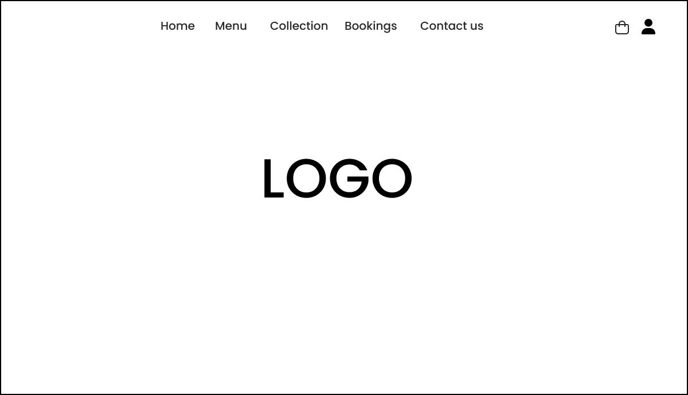
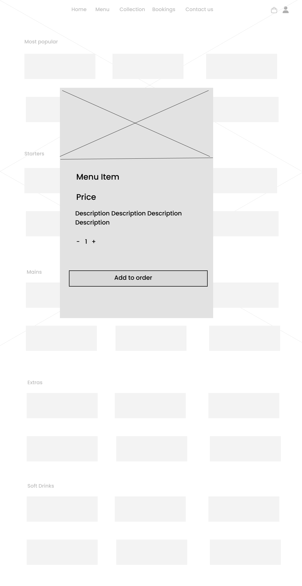
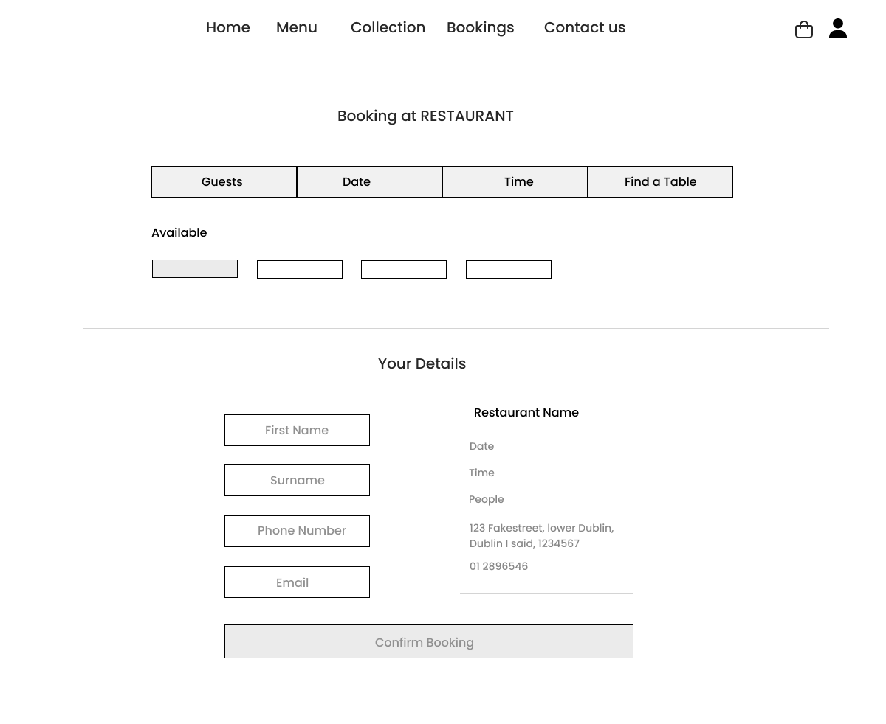
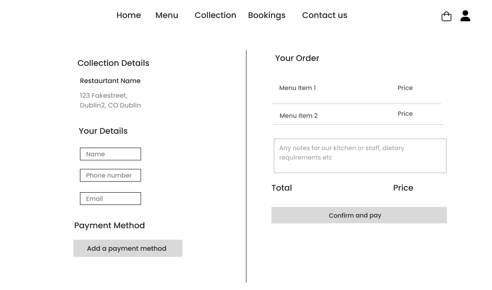

# SLurp Ramen

## Table of Contents

1. [UX](#ux)
    - [Goals](#goals)
        - [Project Goals](#project-goals)
        - [Visitor Goals](#visitor-goals)
    - [User Stories](#user-stories)
    - [Design Choices](#design)
    - [Wireframes](#wireframes)

2. [Features](#features)

# UX

## Goals

### Project Goals

- Provide a user-friendly and effient online ordering system for customers to easily browse the menu, add food to a cart, and complete secure payments.
- Enable customers to book a table for dining in, ensuring availability and a smooth reservation experience. 
- Offer a simple and accessible way for customers to contact the restaurant, wheather for inquiries, reservations, or feedback.
- Ensure the website has distinct branding.
- Ensure the website is fully responsive and optimized for mobile users, allowing customers to access and interact with the site seamlessly on any device.
- To integrate Strip for secure and reliable payment processing of online orders.
- Implement SEO strategies to improve the sites visibility on search engines and attract local customers searching for ramen or Japanese food in Dublin.
- Provide an efficent backend system for restaurant owners to efficiently manage orders, reservations, communications, and customer and user data.

### Visitor Goals

- To easily browse options in the menu, add them to a cart, and place an order for delivery.
- To book a table for dining in.
- To get in touch with the restaurant for information relating to the website.
- To sign up for a newsletter to keep up to date with any changes relevant to the restaurant.
- To have feedback on the website when an action has been successul or unsuccessful.

## User Stories

### User

- As a user I want to view a detailed menu so I can choose the items I want to order.
- As a user I want to add menu items to a shopping cart so I can keep track of my order.
- As a user I want to review my order so I can see the total price before proceeding.
- As a user I want to securely pay for my order online so my information is protected.
- As a user receive confirmation of my successful payment so I know my order has been processed.
- As a user I want to receive email confirmation of my order so I have proof of my purchase.
- As a user I want a user-friendly interface so I can easily navigate the website and order food.
- As a user I want to sign up for a newsletter so I can stay updated with promotions and information.
- As a user I want to create an account so I can place orders and view my past orders.
- As a user I want to log in to my account so I dont have to re-enter my information every time I order.
- As a user I want to log out of my account so I can secure my session.

### Admin

- As an admin I want to be able to add, edit, and remove menu items from admin panel so our information is up to date and correct.
- As an admin I wan to restrict access to certain management functions so only authorized users can perform these actions.

### Developer

- As a developer, I want to ensure that I use defensive programming so users cannot break the site.
- As a developer, i want to ensure users with correct credentials can access correct information.

## Design

#### Fonts

For this site I used the Noto Serif and Noto Sans Google fonts. When paired these two fonts create a balance between tradition and modernity. Noto Serif adds an authentic feel that reflects the rich history of Japanese ramen, while Noto Sans ensure readability and a clean, contemporary user experience.

#### Color

For this site I wanted I wanted to choose colors that use colors that create cohesive design. These colors are below.

-  #1C1C1C - Deep black to provide contact and depth, used for most text.
- #B71C1C - Rich red to adds bold accent to draw attention and create energy.
- #A3B763 - A muted green, creates a freshness and softens overall look.
- #FAF9F6 - Off white offers a clean neatural backdrop to increase readability.

## Wireframes

### Home Page

### Menu Page

### Menu Detail

### Booking Page

### Checkout 

# Features

## Apps

### Home

The home app is for rendering the main landing page of the website. The page serves as a first impression and a central navigation point to explore the rest of the site.

### Menu

The menu app handles the display and management of menu items for the restaurant. The menu view retrieves all menu items from the database and categorizes them into sections such as Most Popular, Starters, Sides, Mains and Soft Drinks, ensuring a well organised presentation of the menu page.

For administrative users, the app provides additional functionality to manage the menu. The add_menu_item view allows superusers to add new dishes through a form, while the edit_menu_item view enables modifications to existing items. The delete_menu_item view allows for the removal of menu items when necessary. These admin-onlyviews ensure that the menu remains up to date, offering an easy way to make changes via the Django admin panel.

#### Menu App Database Schema

The MenuItem model represents individual menu items:

| Field Name      | Data Type         | Description                                 |
|-----------------|-------------------|---------------------------------------------|
| `id`            | Integer           | Primary key, auto-incremented               |
| `category`      | ManyToManyField   | Links to multiple `Category` objects        |
| `name`          | CharField         | Name of the menu item (max length 254)      |
| `description`   | TextField         | Detailed description of the menu item       |
| `price`         | DecimalField      | Price of the menu item (max 6 digits, 2 decimal places) |
| `image`         | ImageField        | Image representing the menu item (nullable) |
| `image_url`     | URLField          | URL of the image representing the menu item (nullable) |

The Category model is used to categorize menu items.

| Field Name      | Data Type         | Description                                 |
|-----------------|-------------------|---------------------------------------------|
| `id`            | Integer           | Primary key, auto-incremented               |
| `category`      | ManyToManyField   | Links to multiple `Category` objects        |
| `name`          | CharField         | Name of the menu item (max length 254)      |
| `description`   | TextField         | Detailed description of the menu item       |
| `price`         | DecimalField      | Price of the menu item (max 6 digits, 2 decimal places) |
| `image`         | ImageField        | Image representing the menu item (nullable) |
| `image_url`     | URLField          | URL of the image representing the menu item (nullable) |

### Bag

The bag app manages the users shopping cart by allowing items to added, updated, or removed. It uses Django sessions to store cart data, ensuring that selections persist across page reloads. The app includes views for viewing the cart, adding items with specified quantities, adjusting item quantities, and removing items. Additionally, it calculates, the total cost, item count, and delivery charges, making this information available via the bag. The data is passed as context, making it accessible throughout the site, ensuriung a consistent and dynamic user experience for the cart and checkout process.

### Checkout

The checkout app handles the stripe payment processing and order creation once a user proceeds with their purchase. It integrates with Stripe's webhook system to manage payment statuses and store orders in the database. The app listens for incoming Stripe webhooks, processes events like payment_itent.succeeded and payment_intent.payment failed, and then takes actions accordingly, such as creating an order, saving customer information, and sending confirmation emails. It ensures that orders are properly recorded and that customers recieve order confirmations after a successful payment.

### Bookings

The bookings app allows customers to make reservations for dining at the restaurant. It uses a form to collect customer details, including name, email,number of people, reservation date, and special requests. When the form is submitted, the app validates the data and creates a booking entry. Upon successful booking, a confirmation email is sent to the customer with the reservation details. The app also displays success message to inform the user that their booking has been confirmed.

### Contact

The contact app enables users to send inquires or feedback to the restaurant through a contact form. The form collects the users name, email, and message. When the form is submitted, the app validates the data, sends the message via email to a specified email address, and stores the data in the database for future reference. Upon successful submission, a success message is displayed to the user, informing them that their message has been sent.

### Newsletter

The newsletter app allows users to subscribe to the restaurants newsletter by entering their email address. When a user submits their email, the app validates the email format, and if valid, saves the email address to the database for future newsletters. After successful submission, the user recieves a confirmation message indicating they have been subscibed. If the email is invalid, and error message will be displayed prompting the user to try again.

### Account

The account app manages user accounts and order histories. It allows users to view and update their account details, such as contact information, through a form. When the form is submitted and validated, the user recieves a success message confirming the update. The app also displays the users past orders by fetching and showing associated orders.

Additionally, users can view and detailed information about individual orders, including items, prices, quantities, and the total cost, through the order history functionality. This is accessible by providing an order number, and the data is returned in JSON format.

