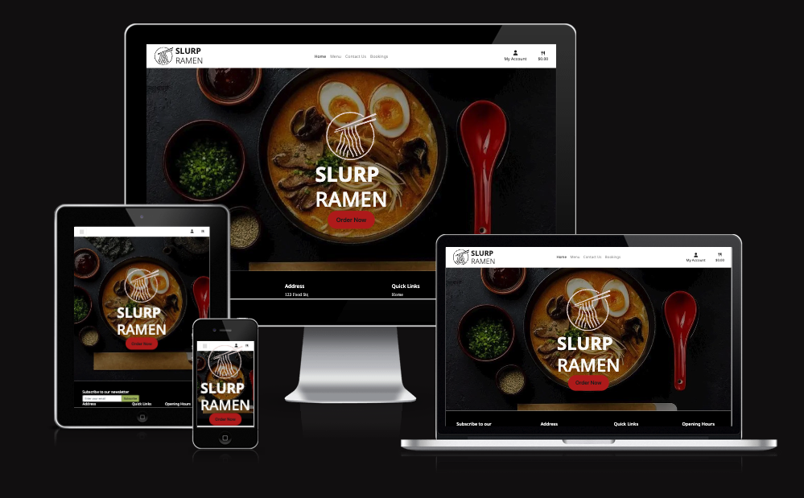
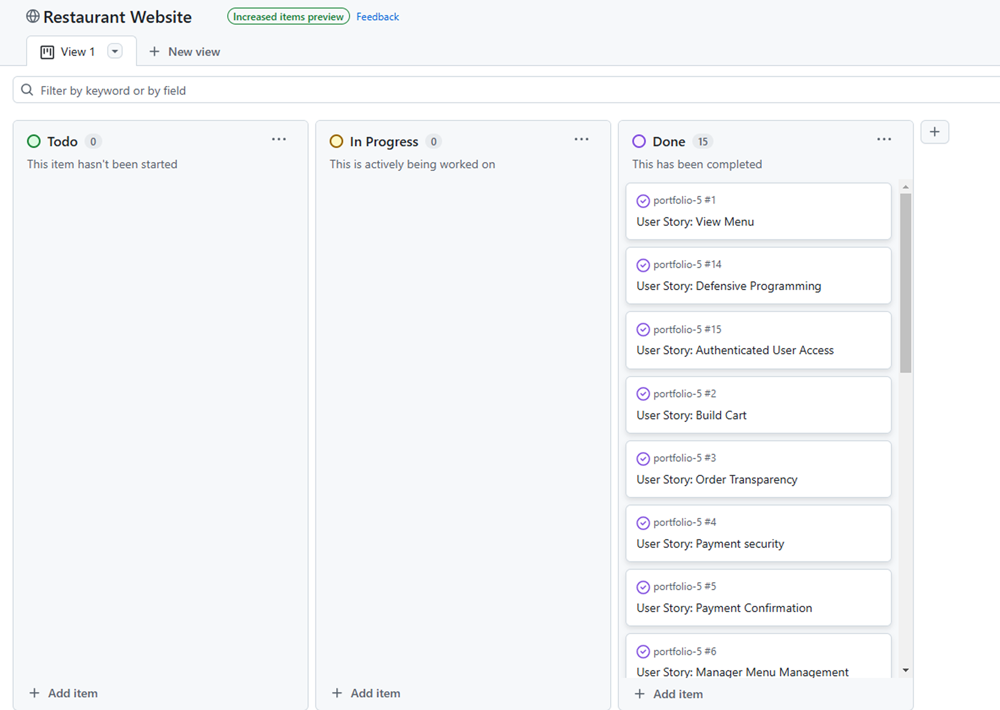
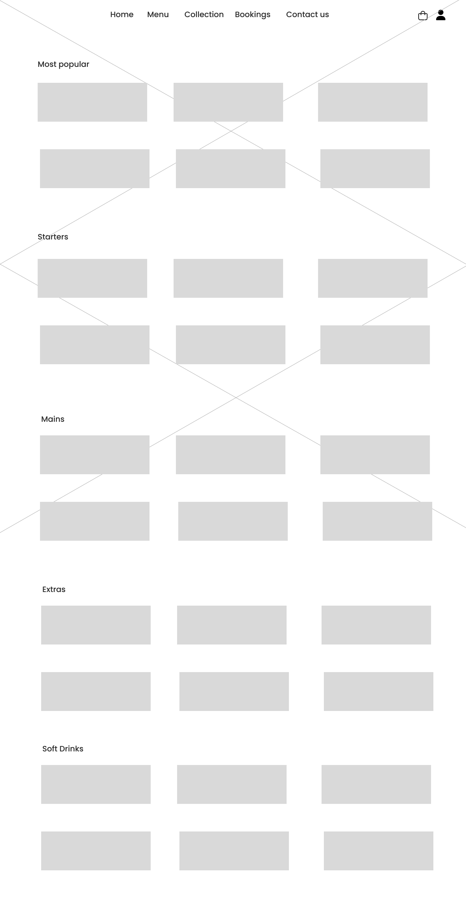
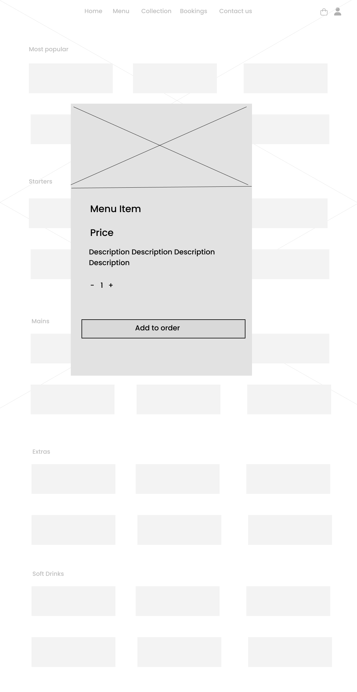
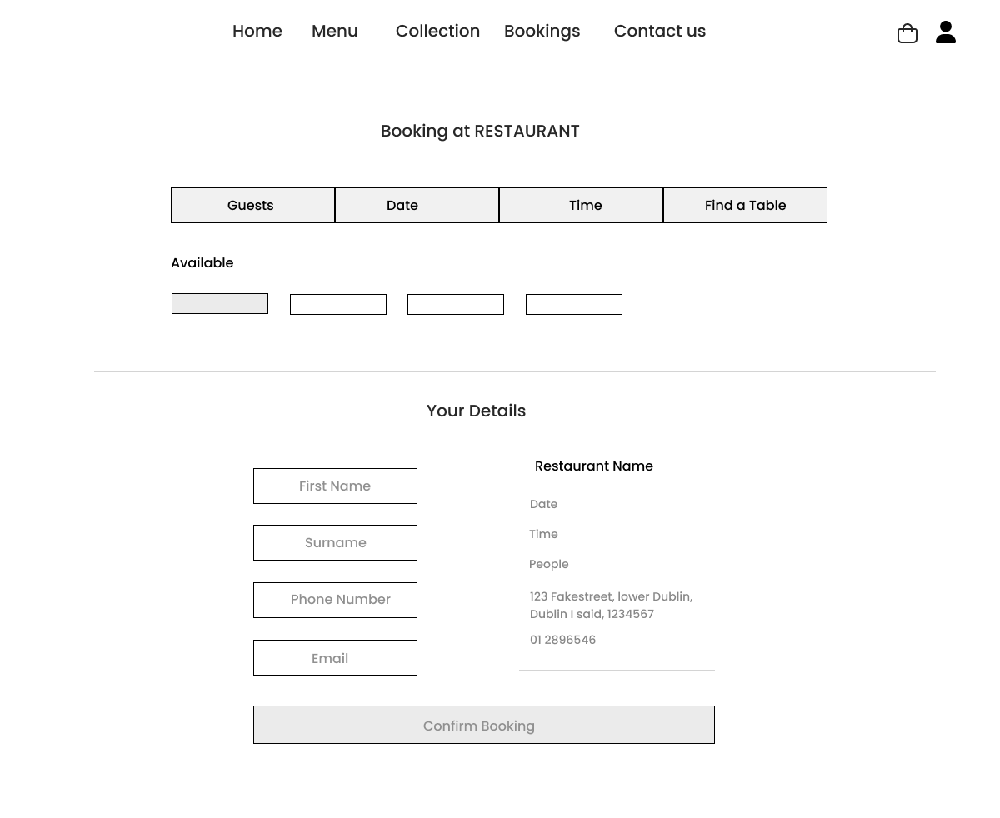
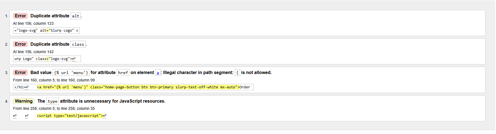
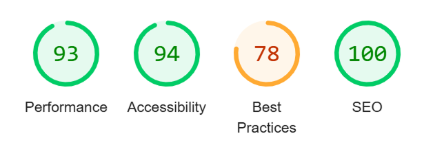
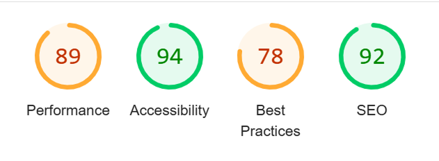
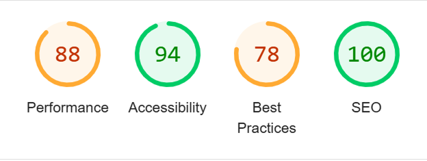
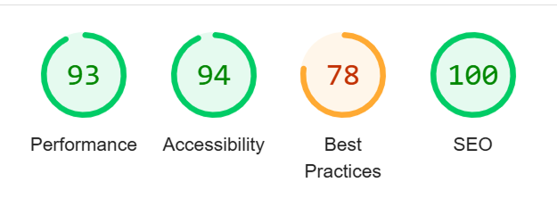

# SLurp Ramen



## Table of Contents

* [**Planning Phase**](#planning)
  * [**Strategy**](#strategy)
      * [**Site Aims**](#site-aims)
      * [**Visitor Goals**](#visitor-goals)
  * [**Agile Methodologies**]
    * [**User Stories**](#user-stories)
  * [**Design**](#design)
  * [**Ecommerce Business Model**]
  * [**Wireframes**](#wireframes)
  * [**SEO Considerations**](#seo-considerations)

* [**Features**](#features)
  * [**Apps**](#apps)
  * [**Future Features**](#future-features)

* [**Testing**](#testing)
  * [**Bugs**](#bugs)
  * [**Automated Testing**](#automated-testing)
  * [**Manual Testing**](#manual-testing)
  * [**Code Validation**](#code-validation)
    * [**Jigsaw**](#jigsaw)
    * [**Pep8 Python**](#python Testing)
    * [**W3C HTML**](#w3c-html)
    * [**JSHINT**](#jshint)
    * [**Lighthouse**](#lighthouse)
      * [**Home**](#lighthouse-home)
      * [**Menu**](#lighthouse-menu)
      * [**Contact**](#lighthouse-contact)
      * [**Bookings**](#lighthouse-bookings)

* [**Deployment**](#deployment)
  * [**Create a databse**](#create-a-database)


# Planning

## Strategy

### Site Aims

- Provide a user-friendly and effient online ordering system for customers to easily browse the menu, add food to a cart, and complete secure payments.
- Enable customers to book a table for dining in, ensuring availability and a smooth reservation experience. 
- Offer a simple and accessible way for customers to contact the restaurant, wheather for inquiries, reservations, or feedback.
- Ensure the website has distinct branding.
- Ensure the website is fully responsive and optimized for mobile users, allowing customers to access and interact with the site seamlessly on any device.
- To integrate Strip for secure and reliable payment processing of online orders.
- Implement SEO strategies to improve the sites visibility on search engines and attract local customers searching for ramen or Japanese food in Dublin.
- Provide an efficent backend system for restaurant owners to efficiently manage orders, reservations, communications, and customer and user data.

### Visitor Goals

- To easily browse options in the menu, add them to a cart, and place an order for delivery.
- To book a table for dining in.
- To get in touch with the restaurant for information relating to the website.
- To sign up for a newsletter to keep up to date with any changes relevant to the restaurant.
- To have feedback on the website when an action has been successul or unsuccessful.

## Agile Methodology

In this project, I adopted a streamlined agile approach using GitHubs issue tracking and project board features. Each task was defined as an issue, with clear acceptance criteria that outlined the expected outcomes for successful complettion. These criteris served as a guide to ensure each feature or fix met the requirements before being moved to the next stage.

The tasks were through various stages on the board, From "To Do" to "In Progress" and ultimately to "Completed" once the acceptance criteria were met.
This ensured a transparent, efficient worflow, with task being cheked and validated against the criteria before being marked as finished.



### User Stories

### User

- As a user I want to view a detailed menu so I can choose the items I want to order.
- As a user I want to add menu items to a shopping cart so I can keep track of my order.
- As a user I want to review my order so I can see the total price before proceeding.
- As a user I want to securely pay for my order online so my information is protected.
- As a user receive confirmation of my successful payment so I know my order has been processed.
- As a user I want to receive email confirmation of my order so I have proof of my purchase.
- As a user I want a user-friendly interface so I can easily navigate the website and order food.
- As a user I want to sign up for a newsletter so I can stay updated with promotions and information.
- As a user I want to create an account so I can place orders and view my past orders.
- As a user I want to log in to my account so I dont have to re-enter my information every time I order.
- As a user I want to log out of my account so I can secure my session.


### Admin

- As an admin I want to be able to add, edit, and remove menu items from admin panel so our information is up to date and correct.
- As an admin I wan to restrict access to certain management functions so only authorized users can perform these actions.

### Developer

- As a developer, I want to ensure that I use defensive programming so users cannot break the site.
- As a developer, i want to ensure users with correct credentials can access correct information.

## Design

#### Fonts

For this site I used the Noto Serif and Noto Sans Google fonts. When paired these two fonts create a balance between tradition and modernity. Noto Serif adds an authentic feel that reflects the rich history of Japanese ramen, while Noto Sans ensure readability and a clean, contemporary user experience.

#### Color

For this site I wanted I wanted to choose colors that use colors that create cohesive design. These colors are below.

-  #1C1C1C - Deep black to provide contact and depth, used for most text.
- #B71C1C - Rich red to adds bold accent to draw attention and create energy.
- #A3B763 - A muted green, creates a freshness and softens overall look.
- #FAF9F6 - Off white offers a clean neatural backdrop to increase readability.


## Wireframes

### Home Page


### Menu Page



### Menu Detail



### Booking Page



### Checkout 


## E-Commerce Business Model

Implementing an e-commerce platform for the restaurant provides a seamless, efficent way for customers to browse the menu, place orders for delivery, or reserve tables for dining in. By offering an online ordering system, the restaurant expands its reach, allowing customers to conveniently place orders anytime, without the need for direct interaction or phone calls. This not only increases sales potential but also provides valuable customer data that can be used for targeted marketing through our newsletter, and improving customer experience.
Additionally, integrating secure payment processing and booking systems enhances customer trust and satisfaction, making the restaurant more accessible and competitive in the digital age. The ecommerce website not only drives revenue but also establishes the restaurants presence in the local online market, attracting new customers while retaining loyal ones.

## Seo Considerations

To optimize my website for search engines, I strategically incorporated relevant keywords into the sites metadata and image attributes. In the head section of my HTML, I included a <meta name="keywords"> tag populated with the key phrases related to ramen in Dublin, such as "best ramen Dublin", "authentic Japanese Ramen", and "ramen Delivery Dublin". Additionally, I enhanced image accessibility and SEO  by descriptive alt attributes to  tags, ensuring that search engines can better understand the contact of my images. These alt texts include keywords such as "best ramen in Dublin", and "Ramen Delivery Dublin", which helps improve visibility in image searches while maintaining usability for visually impaired users. 

# Features

## Apps

### Home

The home app is for rendering the main landing page of the website. The page serves as a first impression and a central navigation point to explore the rest of the site.

### Menu

The menu app handles the display and management of menu items for the restaurant. The menu view retrieves all menu items from the database and categorizes them into sections such as Most Popular, Starters, Sides, Mains and Soft Drinks, ensuring a well organised presentation of the menu page.

For administrative users, the app provides additional functionality to manage the menu. The add_menu_item view allows superusers to add new dishes through a form, while the edit_menu_item view enables modifications to existing items. The delete_menu_item view allows for the removal of menu items when necessary. These admin-onlyviews ensure that the menu remains up to date, offering an easy way to make changes via the Django admin panel.

#### Menu App Database Schema

##### MenuItem Model

| Field Name      | Data Type         | Description                                 |
|-----------------|-------------------|---------------------------------------------|
| `id`            | Integer           | Primary key, auto-incremented               |
| `category`      | ManyToManyField   | Links to multiple `Category` objects        |
| `name`          | CharField         | Name of the menu item (max length 254)      |
| `description`   | TextField         | Detailed description of the menu item       |
| `price`         | DecimalField      | Price of the menu item (max 6 digits, 2 decimal places) |
| `image`         | ImageField        | Image representing the menu item (nullable) |
| `image_url`     | URLField          | URL of the image representing the menu item (nullable) |

##### Category Model

| Field Name      | Data Type         | Description                                 |
|-----------------|-------------------|---------------------------------------------|
| `id`            | Integer           | Primary key, auto-incremented               |
| `category`      | ManyToManyField   | Links to multiple `Category` objects        |
| `name`          | CharField         | Name of the menu item (max length 254)      |
| `description`   | TextField         | Detailed description of the menu item       |
| `price`         | DecimalField      | Price of the menu item (max 6 digits, 2 decimal places) |
| `image`         | ImageField        | Image representing the menu item (nullable) |
| `image_url`     | URLField          | URL of the image representing the menu item (nullable) |

### Bag

The bag app manages the users shopping cart by allowing items to added, updated, or removed. It uses Django sessions to store cart data, ensuring that selections persist across page reloads. The app includes views for viewing the cart, adding items with specified quantities, adjusting item quantities, and removing items. Additionally, it calculates, the total cost, item count, and delivery charges, making this information available via the bag. The data is passed as context, making it accessible throughout the site, ensuriung a consistent and dynamic user experience for the cart and checkout process.


### Checkout

The checkout app handles the stripe payment processing and order creation once a user proceeds with their purchase. It integrates with Stripe's webhook system to manage payment statuses and store orders in the database. The app listens for incoming Stripe webhooks, processes events like payment_itent.succeeded and payment_intent.payment failed, and then takes actions accordingly, such as creating an order, saving customer information, and sending confirmation emails. It ensures that orders are properly recorded and that customers recieve order confirmations after a successful payment.

#### Checkout App Database Schema

##### Order Model

| Field Name        | Data Type                       | Description                                                                   |
|-------------------|---------------------------------|-------------------------------------------------------------------------------|
| `order_number`    | `CharField` (max_length=32)     | Unique order number (automatically generated via UUID).                      |
| `user_account`    | `ForeignKey` (UserAccount)      | Foreign key to the `UserAccount` model representing the user who placed the order. |
| `full_name`       | `CharField` (max_length=50)     | Full name of the person making the order.                                     |
| `email`           | `EmailField` (max_length=254)   | Email address of the person making the order.                                |
| `phone_number`    | `CharField` (max_length=20)     | Phone number of the person making the order.                                  |
| `country`         | `CountryField`                  | The country of the customer (uses `django_countries`).                       |
| `postcode`        | `CharField` (max_length=20)     | Postcode of the customer (optional).                                         |
| `town_or_city`    | `CharField` (max_length=40)     | Town or city of the customer.                                                 |
| `street_address1` | `CharField` (max_length=80)     | Primary street address of the customer.                                       |
| `street_address2` | `CharField` (max_length=80)     | Secondary street address of the customer (optional).                          |
| `county`          | `CharField` (max_length=80)     | County of the customer (optional).                                            |
| `date`            | `DateTimeField`                  | Date and time the order was created.                                          |
| `delivery_cost`   | `DecimalField` (max_digits=6, decimal_places=2) | Delivery cost for the order.                                                  |
| `order_total`     | `DecimalField` (max_digits=10, decimal_places=2) | Total cost of the order before delivery.                                      |
| `grand_total`     | `DecimalField` (max_digits=10, decimal_places=2) | Grand total cost of the order including delivery.                             |
| `original_bag`    | `TextField`                     | Original cart data in text format (used for order reconstruction).            |
| `stripe_pid`      | `CharField` (max_length=254)    | Stripe payment intent ID for the order.                                       |                        |

##### OrderLineItem Model

| Field Name        | Data Type                       | Description                                                                   |
|-------------------|---------------------------------|-------------------------------------------------------------------------------|
| `order`           | `ForeignKey` (Order)            | Foreign key to the `Order` model.                                             |
| `menu_item`       | `ForeignKey` (MenuItem)         | Foreign key to the `MenuItem` model for the item being ordered.               |
| `quantity`        | `IntegerField`                  | The quantity of the item in the order.                                        |
| `lineitem_total`  | `DecimalField` (max_digits=6, decimal_places=2) | Total cost of the line item (calculated as `menu_item.price * quantity`). |


### Bookings

The bookings app allows customers to make reservations for dining at the restaurant. It uses a form to collect customer details, including name, email,number of people, reservation date, and special requests. When the form is submitted, the app validates the data and creates a booking entry. Upon successful booking, a confirmation email is sent to the customer with the reservation details. The app also displays success message to inform the user that their booking has been confirmed.

#### Bookings App Database Schema

##### Booking Model

| Field Name         | Data Type                       | Description                                                                   |
|--------------------|---------------------------------|-------------------------------------------------------------------------------|
| `name`             | `CharField` (max_length=100)    | Name of the person making the booking.                                        |
| `email`            | `EmailField`                    | Email address of the person making the booking.                               |
| `phone_number`     | `CharField` (max_length=15)     | Phone number of the person making the booking.                                |
| `number_of_people` | `IntegerField`                  | Number of people for the booking.                                             |
| `reservation_date` | `DateTimeField`                 | The date and time of the reservation.                                          |
| `special_requests` | `TextField`                     | Any special requests made by the person (optional).                           |
| `status`           | `CharField` (max_length=20)     | Status of the booking, with choices: `pending`, `confirmed`, `cancelled` (defaults to `pending`). |
| `created_at`       | `DateTimeField`                 | The date and time the booking was created.                                    |


### Contact

The contact app enables users to send inquires or feedback to the restaurant through a contact form. The form collects the users name, email, and message. When the form is submitted, the app validates the data, sends the message via email to a specified email address, and stores the data in the database for future reference. Upon successful submission, a success message is displayed to the user, informing them that their message has been sent.

#### Contact App Database Schema

##### ContactMessage Model

| Field Name  | Data Type            | Description                                                   |
|-------------|----------------------|---------------------------------------------------------------|
| `name`      | `CharField` (max_length=100) | Name of the person sending the message.                      |
| `email`     | `EmailField`         | Email address of the person sending the message.              |
| `message`   | `TextField`          | The content of the message sent by the person.                |
| `created_at`| `DateTimeField`      | The date and time the message was created.                    |


### Newsletter

The newsletter app allows users to subscribe to the restaurants newsletter by entering their email address. When a user submits their email, the app validates the email format, and if valid, saves the email address to the database for future newsletters. After successful submission, the user recieves a confirmation message indicating they have been subscibed. If the email is invalid, and error message will be displayed prompting the user to try again.

#### Newsletter App Database Schema

| Field Name    | Data Type             | Description                                                   |
|---------------|-----------------------|---------------------------------------------------------------|
| `email`       | `EmailField`          | The email address of the user subscribing to the newsletter.   |
| `date_subscribed` | `DateTimeField`  | The date and time when the user subscribed to the newsletter. |


### Account

The account app manages user accounts and order histories. It allows users to view and update their account details, such as contact information, through a form. When the form is submitted and validated, the user recieves a success message confirming the update. The app also displays the users past orders by fetching and showing associated orders.

Additionally, users can view and detailed information about individual orders, including items, prices, quantities, and the total cost, through the order history functionality. This is accessible by providing an order number, and the data is returned in JSON format.

| Field Name               | Data Type             | Description                                                                                   |
|--------------------------|-----------------------|-----------------------------------------------------------------------------------------------|
| `user`                   | `OneToOneField(User)` | A reference to the built-in `User` model. Links the `UserAccount` to a specific user.         |
| `default_phone_number`   | `CharField(max_length=20)` | The user's default phone number.                                                             |
| `default_street_address1`| `CharField(max_length=80)` | The user's default street address line 1.                                                     |
| `default_street_address2`| `CharField(max_length=80)` | The user's default street address line 2 (optional).                                          |
| `default_town_or_city`   | `CharField(max_length=40)` | The user's default town or city.                                                              |
| `default_county`         | `CharField(max_length=80)` | The user's default county (optional).                                                         |
| `default_country`        | `CountryField`         | The user's default country, stored as a country code.                                         |
| `default_postcode`       | `CharField(max_length=20)` | The user's default postcode (optional).                                                      |

## Future Features

### Loyalty Program

- Implement rewards program where customers can earn points for every purchase and redeem them for discounts or free items.

### Order Customization

- Allow customers to customize their food orders (eg. adding extra toppings, changing seasonings, etc) directly from the menu.

### Real-Time Order Tracking

- Provide customers with real time updates on their order status, from preperation to delivery, with push notifications for live tracking.

### Customer Reviews and Ratings

- Add functionality for customers to leave reviews and ratings for menu items and their overall experience.

### Gift Cards

- Implement a feature for customers to purchase and redeem digital gift cards for use in the restaurant.

# Testing

## Bugs

Issue: After deployment the send mail function was yielding a 500 server error.

Cause: Incompatability with send mail and python 3.12.

Solution: Downgrade to Pyton 3.11

Status: Fixed
_______

Issue: Unable to install allauth.

Cause: Incompatability of version of setuptools installed.

Solution: Upgrade setuptools to version 67.0.0

Status: Fixed

___

Issue: Webhooks creates the order in the database everytime a payment is processed.

Cause: Potentially cause by the matching criteria used in the webhook that checks if the order has been created being too specif, and leading to the webhook never registering the oder has been created.

Solution: Even though this was happening, it isnt creating duplicate orders and the payment flow was still working, which lead me to beleive the best option was to leave it as its not a major issue.

Status: Unfixed

## Manual Testing

### User Story Testing

#### Visitor Stories Testing

| **Test**                                      | **Description**                                                     | **Expected Result**                                                        | **Result**                               |
|-----------------------------------------------|---------------------------------------------------------------------|----------------------------------------------------------------------------|------------------------------------------|
| View detailed menu                            | Test if users can view a detailed menu.                             | Menu should display all items with details like name, description, price.  | Pass                                     |
| Add items to shopping cart                            | Test if users can add items to the shopping cart                             | Items are added to the cart with the correct, name, price, and quantity  | Pass                                     |
| Review order                                  | Test if users can review their order before proceeding.             | Users should see the cart with the total price and itemized order.        | Pass                                     |
| Secure payment process                        | Test if users can securely pay for their order online.              | Payment should be processed securely with encrypted information.          | Pass
| Payment confirmation                          | Test if users receive a confirmation after a successful payment.     | A confirmation page with order details appears after the payment is made. | Pass                                     |
| Email confirmation                            | Test if users receive an email confirmation for their order.        | User receives an email with order details after successful payment.       | Pass                                     |
| User-friendly interface                       | Test if the website interface is easy to navigate for users.        | Website layout and design should be intuitive and easy to navigate.       | Pass                                     |
| Sign up for newsletter                        | Test if users can sign up for the newsletter.                        | A sign-up form should accept valid emails and display a confirmation.     | Pass                                     |
| Account creation                              | Test if users can create an account.                                | User should be able to register an account with valid information.        | Pass                                     |
| User login                                     | Test if users can log in to their account.                          | Users can log in using their registered credentials.                       | Pass                                     |
| User logout                                    | Test if users can log out of their account.                         | Users can log out, and their session is secured.                           | Pass                                     |


#### Admin Stories Testing

| **Test**                                      | **Description**                                                     | **Expected Result**                                                        | **Result**                               |
| Add, edit, and remove menu items              | Test if the admin can add, edit, or remove menu items.              | Admin can successfully perform these actions through the admin panel.     | Pass                                     |
| Restrict access to management functions       | Test if admin functions are restricted to authorized users.        | Unauthorized users should not have access to admin management functions. | Pass                                     |

#### Developer Stories Testing

| **Test**                                      | **Description**                                                     | **Expected Result**                                                        | **Result**                               |
|-----------------------------------------------|---------------------------------------------------------------------|----------------------------------------------------------------------------|------------------------------------------|
| Defensive programming                         | Test if the site handles errors and invalid inputs properly.        | Site should not break and should handle invalid inputs gracefully.        | Pass                                     |
| User credentials and data access              | Test if users with correct credentials can access their data.      | Only users with valid credentials should be able to view their own data.  | Pass  

## Code Validation

### Jigsaw

Jigsaw was used to validate CSS code. No errors.

### Pep8 Python

Pep was used to validate python code

### JSHINT

JSHINT was used to validate Python code. Only result of note is a report of undefined variable for stripe, which doesn't acknowledge Stipes library being loaded, so it is a false positive.

### WCS Schools

w3 schools was used to validate html code, some errors were reported but were due to rendering issues with Django templates, which were unavoidable.



## Lighthouse

### Home Page



### Menu Page



### Contact Page



### Booking Page



### Lighhouse score review

The best practices score was low on all pages, due to issues with stripe which is unavoidbale, also on pages, where media was being sourced from AWS, that brought the performance down.

# Deployment

### Database set up

1. Navigate to PostreSQL from Code Institute

2. Enter email address

3. Click Submit, link will be sent to email address.

### Create Heroku App

1. Click New to create a new app. 

2. Gave app a name and selected EU region.

3. Click Create app. 

4. Navigate to settings tab.

5. Add the config var DATABASE_URL and add the database url from the PostgreSQL codeinstitute email.

### Conntect to local development server

1. In vscode terminal, install dj_database_url and psycopg2 using command:

`pip3 install dj_database_url==0.5.0 psycopg2`

2. Update requirements.txt file with new packages:

`pip freeze > requirements.txt`

3. In settings.py file, import dj_database_url underneath import for os.

4. In the database section of settings.py so that original connection to sqlite3 is commented out and can connect to new database instead. Paste database URL from postgreSQL in to position indicated:

 
`DATABASES = {
    'default': dj_database_url.parse('your-database-url-here')
}`

5.In the terminal, run the showmigrations command to confirm connection to database. 

`python3 manage.py showmigrations`

6. Migrate database models to new database.

`python3 manage.py migrate`

7. Load in fixtures from menu and categories models, ensuring to load categories first.

`python3 manage.py loaddata categories`

8. Then, load in menu fixtures.

`python3 manage.py loaddata menu`

9. Create new superuser for database.

`python3 manage.py createsuperuser`

10. Delete code added for new database_url to prevent being exposed to github.

```python
DATABASES = {
    'default': dj_database_url.parse('your-database-url-here')
}
```

### Deploy to Heroku

1. Locate DATABASES settings in settings.py.

2. Update the code to ensure that development environment can continue to access local SQLite database, and deployed site can simultaneously access newly created database.

```python
if 'DATABASE_URL' in os.environ:
    DATABASES = {
        'default': dj_database_url.parse(os.environ.get('DATABASE_URL'))
    }
else: 
    DATABASES = {
        'default': {
            'ENGINE': 'django.db.backends.sqlite3',
            'NAME': BASE_DIR / 'db.sqlite3',
        }
    }
```

3. Locate where env module is imported in settings.

4. Update code to check if file exists in the in environment before trying to import it, to avoid errors when Heroku tries to access the file.

5. Create Procfile in root directory of project.

6. Tell Heroku to create web dyno and run gunicorn to serve django app by adding this line to Procfile:

`web: gunicorn slurp-ramen.wsgi:application`

7. Ensure Heroku uses correct version of Python by adding a runtime.txt file to root directory, and inside it add:

`python-3.11.11`

8. Return to Heroku dashboard and click Open app, copy the url.

9. Go back to settings.py, add the copied URL the the ALLOWED_HOSTS, ensuring to remove https:// from url start.

### Installing gunicorn

1. In the vscode terminal install gunicorn using

`pip3 install gunicorn`

2. Freeze updated dependencies into requirements.txt file.

`pip3 freeze --local > requirements.txt`

3. Save, commit and push all changes to github.

### Prepare Herkoku settings

1. Go back to Heroku, navigate to app settings.

2. Open config vars.

3. Create new environment variable and name in DISABLE_STATIC with a value of 1, temporarily preventing Heroku from uploading Heroku from uploading static files.

4. Create a new environment variable called SECRET_KEY and set value to any random string, this should be different than the secret key set env.py in IDE.

### Deploy the app

1. On Heroku dashboard, select the deploy tab.

2. Scroll to the deployment method tab and select github to connect to github repository.

3. Search for the repository name, then click connect.

4. Click the Enable Deploys button to ensure anytime you push code to github repositoy, Heroku will also update.

5. Click Deploy Branch.

7. Build may take several minutes, once completed, click on Open app. Because static files are not yet collected, will look different but should be functional.

### Conditionally set to DEBUG

1. Once confirmed project has deployed, navigate back to settings.py in vscode and add this line of code to ensure that debug is only set to true in the development environment.

`DEBUG = 'DEVELOPMENT' in os.environ`

2. In env.py file, add a new environment variable for DEVELOPMENT and set it to '1'.

`os.environ.setdefault('DEVELOPMENT', '1')`

3. Add, commit and push changes to Github.

###  Setting up AWS bucket

1. Open new browser windown and navigate to https://aws.amazon.com/.

2. If no existing account, click create account, enter in email and password.

3. Sign in to AWS with email and password.

4. Once signed in, navigate to AWS Management Console.

5. Using the search bar, type S3 and choose S3 from options.

6. Click create new bucket.

7. Create a new bucket by
  - Entering in name
  - Select 'ACLs enabled'
  - Select bucket ownder preferred
  - Deselect 'Block all public access'
  - Check the box to acknowledge the risk of public access.
  - Leave the other options unchanged and click 'Create bucket'

  8. When bucket is created click on the bucket name to view the bucket details.

  9. Click on the 'Properties' tab. 

  10. Scroll down to the 'static website hosting' section and click 'Edit'.

  11. Click enable.

  12. Enter 'index.html' (without quotes) into the index document input.

  13. Enter 'error.html' (without quotes) into the Error document input.

  14. Click 'Save Changes'.

  15. Click on the permissions tab.

  16. Scroll down to the Cross-origin resource sharing (CORS) section and click 'Edit'.

  17. Add the following code for the CORS settings and click 'Save Changes'.

  ```python
  [
{
"AllowedHeaders": ["Authorization"],
"AllowedMethods": ["GET"],
"AllowedOrigins": ["*"],
"ExposeHeaders": []
}
]
```

18. On the permissions tab of the S3 bucket, scroll to the 'Bucket Policy' section and click 'Edit', then click 'Policy Generator'.

19. In the new tab that opens:

- For policy type select 'S3 Bucket Policy'.
- For the principle enter '*' (without quotes).
- For action select 'Get Object' from the dropdown.

20. Go back to bucket policy editor and click the copy button to copy the ARN.

21. Then, go back to the Policy Generator in the other tab, paste the the ARN into the ARN input and click 'Add Statement'.

22. Scroll down and click 'Generate Policy'.

23. Copy all of the text in the popup.

24. go back to the policy editor in the other tab and past in the policy code.

25. Edit 'Resource' value by adding '/*' to the end, to allow access to all objects within the bucket, should look like the below but with ARN that has been copied:

```python
{
"Version": "2012-10-17",
"Id": "Policy1720032710777",
"Statement": [
{
"Sid": "Stmt1720024120521",
"Effect": "Allow",
"Principal": "*",
"Action": "s3:GetObject",
"Resource": "YOUR_ARN/*"
}
]
}
```
26. Scroll down to the bottom and click 'Save Changes'.

27. Back in the permissions tab, scroll down to the Access Control list section and click 'Edit'.

28. On the 'Edit Access control list' page:

- Click 'List' in the Everyone(public access)
- Click the checkbox to indicate understanding of changes.

29. Click 'Save Changes'.

### Create AWS Groups, Policies and Users

1. Search for 'iam' in the search bar.

2. Click on 'IAM'.

3. Click 'User Groups'.

4. Click 'Create Group'.

5. Enter group name (I chose slurp-rame).

6. Scroll down to the bottom and click 'Create User Group'.

7. Click 'Policies' in the menu on the left.

8. Click 'Create Policy'.

9. Click on the 'JSON' tab'.

10. Click on 'Actions' dropdown.

11. Click 'Import Policy'.

12. Search for 's3'.

13. Select 'AmazonS3FullAccess'.

14. Click 'Import Policy'.

15. Search 's3' at the top.

16. Right click on 'S3'/

17. Click 'Open in new tab'.

18. In the new tab:

- Select your bucket.
- Click 'Copy ARN'

19. Go back to previous tab and add ARN in quotes to the 'Resource' list twice, add /* after the second one. Policy shoud look like the below:

```python
{
"Version": "2012-10-17",
"Statement": [
{
"Sid": "Statement1",
"Effect": "Allow",
"Action": [
"s3:*"
],
"Resource": [
"arn:aws:s3:::slurp-ramen-bucket",
"arn:aws:s3:::test-bucket-bucket/*"
]
}
]
}
```

20. Scroll down to the bottom and click 'Next'.

21. Enter policy name and description.

22. Scroll down and click 'Create Policy', and you will see a success message.

23. Click 'User Groups' in the menu to the left.

24. Click on your group.

25. Click on the 'Permissions' tab.

26. Click on 'Add permissions' dropdown.

27. Click 'Attach policies'.

28. Search for the policy name (slurp ramen)

29. Select the checkboxes beside that policy.

30. Click 'Attach policies'.

31. Click 'Users' in the menu on the left.

32. Click 'Create User'.

33. Enter a user name.

34. Click 'Next'.

25. Select the group you created previously.

26. Click 'Next'.

27. Scroll down and click 'Create user'.

28. Click on the new user.

29. Click 'Security credentials'.

30. Scroll down to the 'Access keys' section and click 'Create access key'.

31. Select 'Application running outside AWS'

32. Click 'Next'

33. Click 'Create access key'.

34. Scroll down and click 'Download .csv file'.

25. Click done.

26. Open the .csv file in any text editor.

27. The two values will be seperated by a comma, and are the AWS_ACCESS_KEY_ID and AWS_SECRET_ACCESS_KEY for Heroku config vars.

### Connecting to Django

1. To connect django to s3, install the required packages.

`pip3 install boto3 django-storages`

2. Update the requirments.txt so these packages are installed in Heroku environment.

`pip3 freeze > requirements.txt`

3. Add storages to installed apps by navigating to settings.py and adding 'storages' to the list of INSTALLED_APPS.

4. To Configuare django to communicate with the S3 bucket. This should only apply when running on Heroku. We need to add an if statment to check for the USE_AWS environment variable.

```python
if 'USE_AWS' in os.environ:
    AWS_STORAGE_BUCKET_NAME = os.environ.get('AWS_STORAGE_BUCKET_NAME')
    AWS_S3_REGION_NAME = os.environ.get('AWS_S3_REGION_NAME')
    AWS_ACCESS_KEY_ID = os.environ.get('AWS_ACCESS_KEY_ID')
    AWS_SECRET_ACCESS_KEY = os.environ.get('AWS_SECRET_ACCESS_KEY')
```

5. Go to Herokus config vars and add the following variables:

```python
USE_AWS=true
AWS_STORAGE_BUCKET_NAME
AWS_S3_REGION_NAME
AWS_ACCESS_KEY_ID
AWS_SECRET_ACCESS_KEY
```

6. While in Heroku settings, remove DISABLE_STATIC variable so Django automatically uploads static files to s3 during deployment.

7. In settings.py, specify where static files will be stored in production by adding:

```python
AWS_S3_CUSTOM_DOMAIN = f"{AWS_STORAGE_BUCKET_NAME}.s3.amazonaws.com"

STATIC_URL = f"https://{AWS_S3_CUSTOM_DOMAIN}/static/"
MEDIA_URL = f"https://{AWS_S3_CUSTOM_DOMAIN}/media/"
```

8. Create a new file in any app in your project and name it custom_storages.py, and add the following code:

```python
from django.conf import settings
from storages.backends.s3boto3 import S3Boto3Storage

class StaticStorage(S3Boto3Storage):
    location = settings.STATICFILES_LOCATION

class MediaStorage(S3Boto3Storage):
    location = settings.MEDIAFILES_LOCATION
```

9. In settings.py, define the locations and specify the storage classes:

```python
STATICFILES_LOCATION = 'static'
MEDIAFILES_LOCATION = 'media'

STATICFILES_STORAGE = 'custom_storages.StaticStorage'
DEFAULT_FILE_STORAGE = 'custom_storages.MediaStorage'
```

10. Git add, commit and push changes to deploy to heroku, during deployment heroku will run:

`python3 manage.py collectstatic`

11. Verify deployment by checking Heroku build log to confirm static files were created successfully.

### Caching, Media Files and Stripe

1. Go to S3 bucket, create new folder called media.

2. Inside new folder click upload.

3. Click add files.

4. Select all media images for site and click 'Open'.

6. Under 'Manage public permsions' click 'Grant Public Read Access'.

7. Click 'Next' end and click 'Upload'.

8. Sign into admin and 'Add new user'.

9. Verfify their email address by clicking 'Primary' and 'Verifed', then click 'Save'.

### Stripe

1. Log into Stripe account.

2. Click on Developers.

3. Click on API keys.

4. Copy the secret_key and publishable_key.

5. Copy those values into Heroku config vars as STRIPE_SECRET_KEY and STRIPE_PUBLIC_KEY

6. GO back to Stripe dashboard. 

7. Click 'Developers', then click 'Webhooks'.

8. Click 'Add endpoint'

9. Paste in the url from the deployed website, adding in 'checkout/wh/' to the end of the URL.

10. Select 'All Events'.

11. Click 'Add Events'.

12. Scroll down to the bottom of the page, then click 'Add endpoint'.

13. Click 'Reveal' to access the signing secret for the new endpoint. Copy the secret provided.

14. Go back to Heroku dhasboard for the app, then settings tab and config vars.

15. Add new variable called STRIPE_WH_SECRET to set the signing secret with the value just copied from stripe. 

16. Redeploy the app to ensure environment variable is accessible.

### Testing Webhooks

1. To Test unhandled and payment intent succeeded webhook navigat to deployed app in the browser by go to heroku deploy tab and clicking 'Open app'.

2. Enter the credit card number 4242 4242 4242 4242, a valid expiry date, any random 3 digit CVC code and any 5 digit zip code, then click 'Complete Order'.

3. Return to Webhooks tab in the Developers dashboard and click on webhooks, then click on the end point created.

4. CLick on payment intent succeeded, a 200 response confirms the webhook has been delivered successfully.

5. To check payment intent failed, navigate back to deployed site, create an order, and at the checkout page enter in delivery details, enter in credit card number 4000 0000 0000 0002, a valid expiry, and any CVC and zip code.

6. Click on 'Complete Order'.

7. Naviate back to stripe dashboard, webhooks then click on endpoint.

8. Click on payment intent failed, and it will confirm id payment intent failed has been successful recieved.


    


